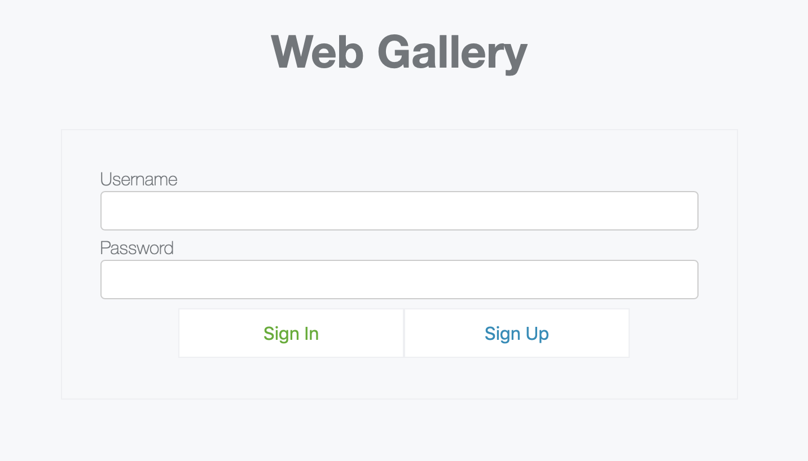
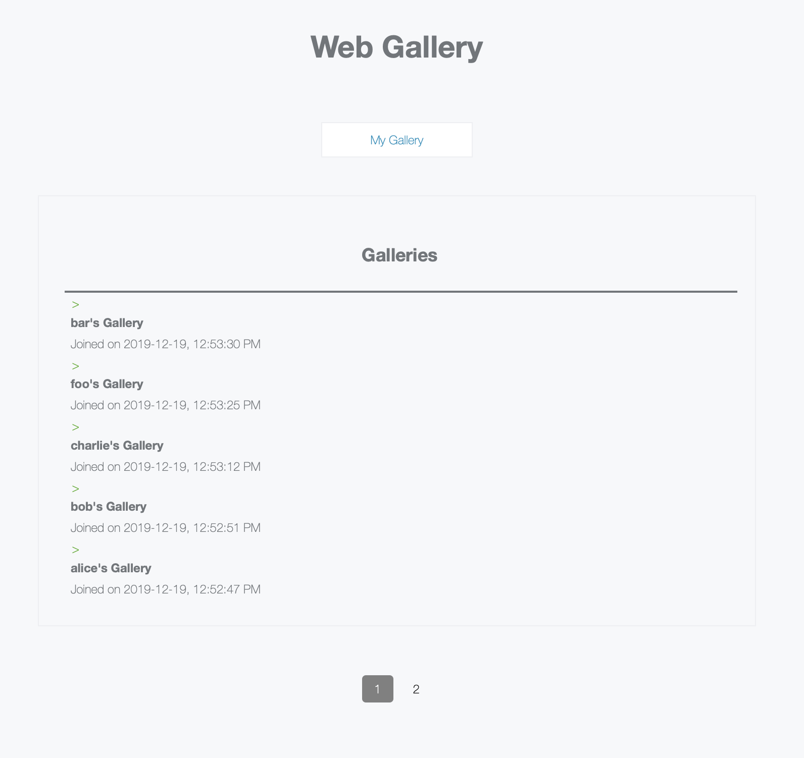
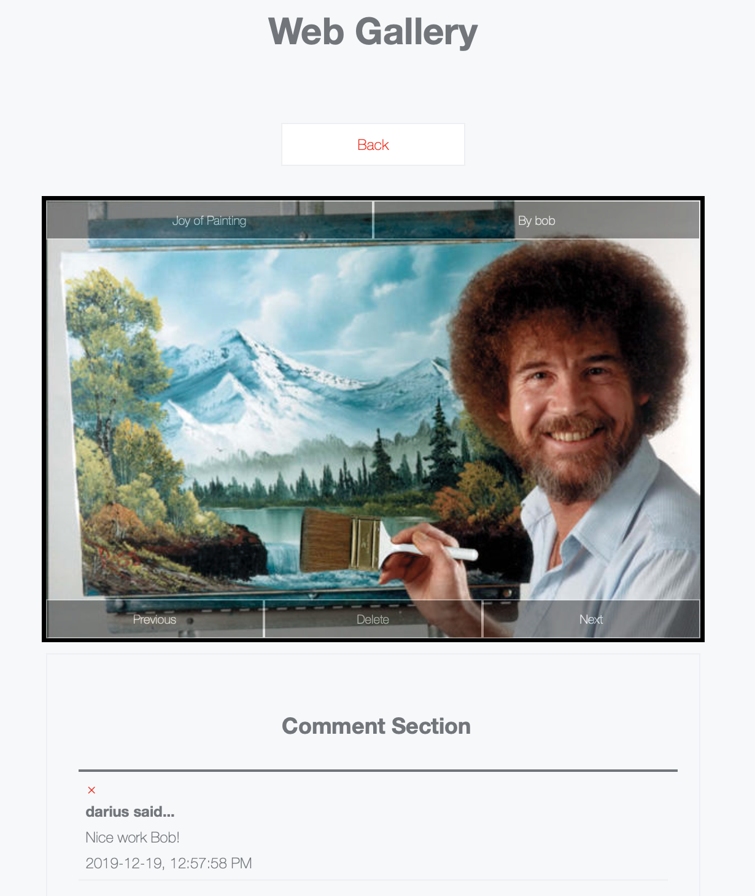

# Web Gallery
A simple gallery hosting website built using an Express backend and vanilla JS for frontend.

## Running Instructions
```
cd src
npm install
node app.js
```

## Requirements
- Non authenticated cannot read any picture nor comment
- Non-authenticated can sign-up and sign-in into the application
- Authenticated users can sign-out of the application
- Authenticated users can browse any gallery
- Gallery owners can upload and delete pictures to their own gallery only
- Authenticated users can post comments on any picture of any gallery
- Authenticated users can delete any one of their own comments but not others
- Gallery owners can delete any comment on any picture from their own gallery

## Screenshots
### Sign in


### Gallery Browser


### Gallery Viewer


## API Documentation
### User Management

- description: add a new user
- request: `POST /signup/`
    - content-type: `application/json`
    - body: object
        - username: (string) the username for the new user
        - password: (string) the password for the new user
- response: 200
    - body: (string) user `<username>` signed up
- response: 409
    - body: (string) user `<username>` already exists

```
$ curl -v -X POST \
       -H "Content-Type: application/json" \
       -d '{"username":"username","password":"password"}' \
       -c cookies \
       "http://localhost:3000/signup/"
```

- description: login a user and start a session
- request: `POST /signin/`
    - content-type: `application/json`
    - body: object
        - username: (string) the username for the user
        - password: (string) the password for the user
- response: 200
    - body: (string) user `<username>` signed in
- response: 401
    - body: (string) access denied

```
$ curl -v -X POST\
       -H "Content-Type: application/json"\
       -d '{"username":"username","password":"password"}'\
       -c cookies\
       "http://localhost:3000/signin/"
```

- description: logout the user and destroy the request's session
- request: `GET /signout/`
- response: 302
    - body: (string) Found. Redirecting to /

```
$ curl -v -X GET\
       -b cookies\
       "http://localhost:3000/signout/"
```

### Users

- description: retrieve users at given page
- request: `GET /api/users/[?page=1]`
- response: 200
    - content-type: `application/json`
    - body: list of objects
        - _id: (string) the username
        - createdAt: (date) when the user was created
        - updatedAt: (date) when the user was updated
- response: 401
    - body: access denied

```
$ curl -v -X GET\
       -H "Content-Type: application/json"\
       -b cookies\
       "http://localhost:3000/api/users/?page=1"
```

- description: retrieve user count
- request: `GET /api/users/count`
- response: 200
    - body: (int) the user count
- response: 401
    - body: (string) access denied

```
$ curl -v -X GET\
       -H "Content-Type: application/json"\
       -b cookies\
       "http://localhost:3000/api/users/count/"
```

### Images

- description: add an image
- request: `POST /api/images/`
    - content-type: `multipart/form-data`
    - body: object
        - title: (string) the image title
        - file: (file) the file to upload
- response: 200
    - content-type: `application/json`
    - body: object
        - _id: (string) the new image id
        - title: (string) the title of the new image
        - file: (object) the new file's metadata
        - createdAt: (date) when the image was created
        - updatedAt: (date) when the image was updated
- response: 401
    - body: (string) access denied

```
$ curl -v -X POST\
       -H "Content-Type: multipart/form-data"\
       -F "title=title"\
       -F "file=@/path/to/image.jpg"\
       -b cookies\
       "http://localhost:3000/api/images/"
```

- description: delete an image
- request: `DELETE /api/images/:id`
- response: 200
    - content-type: `application/json`
    - body: object
        - _id: (string) the deleted image id
        - title: (string) the title of the deleted image
        - file: (object) the image file's metadata
        - createdAt: (date) when the image was created
        - updatedAt: (date) when the image was updated
- response: 404
    - body: (string) image not found
- response: 401
    - body: (string) access denied

```
$ curl -v -X DELETE\
       -b cookies\
       "http://localhost:3000/api/images/:id"
```

- description: get an image
- request: `GET /api/images/:id`
- response: 200
    - content-type: `application/json`
    - body: object
        - _id: (string) the deleted image id
        - title: (string) the title of the deleted image
        - file: (object) the image file's metadata
        - createdAt: (date) when the image was created
        - updatedAt: (date) when the image was updated
- response: 404
    - body: (string) image not found
- response: 401
    - body: (string) access denied

```
$ curl -v -X GET\
       -b cookies\
       "http://localhost:3000/api/images/:id"
```

- description: get images
- request: `GET /api/images/?[createdAt=(lt|gt):<date>]&[author=author]`
- response: 200
    - content-type: `application/json`
    - body: list of objects
        - _id: (string) the deleted image id
        - title: (string) the title of the deleted image
        - file: (object) the image file's metadata
        - createdAt: (date) when the image was created
        - updatedAt: (date) when the image was updated
- response: 401
    - body: (string) access denied

```
$ curl -v -X GET\
       -b cookies\
       "http://localhost:3000/api/images/?author=username&createdAt=gt:2019-01-22T20:29:49.992Z"
```

### Comments

- description: add a comment
- request: `POST /api/comments/`
    - content-type: `application/json`
    - body: object
        - imageId: (string) the image the comment is for
        - content: (string) the comment text
- response: 200
    - content-type: `application/json`
    - body: object
        - _id: (string) the new comment id
        - author: (string) the username of the author
        - content: (string) the content of the message
        - imageId: (string) the image the comment is for
        - createdAt: (date) when the image was created
        - updatedAt: (date) when the image was updated
- response: 404
    - body: (string) image not found
- response: 401
    - body: (string) access denied

```
$ curl -v -X POST\
       -H "Content-Type: application/json"\
       -d '{"imageId":"<imageId>","content":"a comment"}'\
       -b cookies\
       "http://localhost:3000/api/comments/"
```

- description: delete a comment
- request: `DELETE /api/comments/:id`
- response: 200
    - content-type: `application/json`
    - body: object
        - _id: (string) the deleted comment id
        - author: (string) the username of the author
        - content: (string) the content of the message
        - imageId: (string) the image the comment is for
        - createdAt: (date) when the image was created
        - updatedAt: (date) when the image was updated
- response: 404
    - body: (string) comment not found
- response: 401
    - body: (string) access denied

```
$ curl -v -X DELETE\
       -b cookies\
       "http://localhost:3000/api/comments/:id"
```

- description: get the latest 5 comments
- request: `GET /api/comments/?[imageId=imageId]`
- response: 200
    - content-type: `application/json`
    - body: list of objects
        - _id: (string) the comment id
        - author: (string) the username of the author
        - content: (string) the content of the message
        - imageId: (string) the image the comment is for
        - createdAt: (date) when the image was created
        - updatedAt: (date) when the image was updated
- response: 401
    - body: (string) access denied

```
$ curl -v -X GET\
       -b cookies\
       "http://localhost:3000/api/comments/?imageId=imageId"
```
